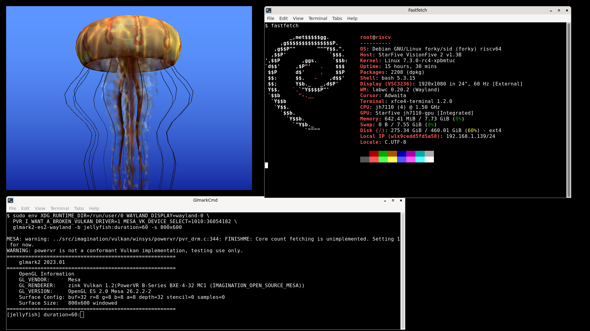

# JH7110 / VisionFive 2 - PowerVR BXE-4-32 GPU + DC8200 display bring-up



## Summary

With a few small kernel changes you can get experimental GPU 3D graphics working
on the StarFive VisionFive 2.

### vkmark test results

The following results are from vkmark under three configurations: direct KMS
scanout (no compositor, no window) and two Wayland compositors, labwc and
Weston. The physical screen always runs at its native 1920x1080.

`vkmark` itself is tested windowed at 1920x1080 and 800x600:

| Scene | FPS (KMS, 1920x1080) | FPS (labwc, 1920x1080) | FPS (labwc, 800x600) | FPS (Weston, 800x600) |
|---|---|---|---|---|
| clear | 485 | 55 | 215 | 209 |
| cube | 140 | 30 | 153 | 133 |
| shading | 84 | 21 | 71 | 61 |
| desktop | 19 | 7 | 39 | 30 |
| effect2d | 9 | 5 | 20 | 22 |
| texture | 78 | 21 | 94 | 80 |
| vertex | 124 | 28 | 103 | 81 |

Command line invocation and output, e.g.:

- [`vkmark_7scenes_kms_mesa26.2.3-2_1920x1080_20sec_output.txt`](vkmark_7scenes_kms_mesa26.2.3-2_1920x1080_20sec_output.txt)
- [`vkmark_7scenes_labwc_mesa26.2.3-2_1920x1080_20sec_output.txt`](vkmark_7scenes_labwc_mesa26.2.3-2_1920x1080_20sec_output.txt)
- [`vkmark_7scenes_labwc_mesa26.2.3-2_800x600_20sec_output.txt`](vkmark_7scenes_labwc_mesa26.2.3-2_800x600_20sec_output.txt)
- [`vkmark_7scenes_weston_mesa26.2.3-2_800x600_20sec_output.txt`](vkmark_7scenes_weston_mesa26.2.3-2_800x600_20sec_output.txt)


### glmark2-es2-wayland test results

The following results are from glmark2-es2-wayland (OpenGL ES via Zink) under
two Wayland compositors, Weston and labwc. The physical screen always runs at
its native 1920x1080.

`glmark2` itself is tested windowed at 1920x1080 and 800x600:

| Scene | FPS (Weston, 1920x1080) | FPS (labwc, 1920x1080) | FPS (Weston, 800x600) | FPS (labwc, 800x600) |
|---|---|---|---|---|
| clear | 22 | 22 | 54 | 60 |
| shading | 16 | 18 | 45 | 42 |
| bump | 16 | 19 | 45 | 50 |
| function | 11 | 16 | 41 | 41 |
| texture | 15 | 18 | 45 | 44 |
| ideas | 7 | 11 | 16 | 14 |
| shadow | 5 | 5 | 15 | 14 |
| pulsar | 9 | 12 | 32 | 39 |
| refract | 3 | 3 | 4 | 4 |
| conditionals | 10 | 16 | 40 | 40 |
| effect2d | 6 | 10 | 37 | 40 |
| loop | 9 | 14 | 31 | 36 |
| buffer | 7 | 9 | 16 | 21 |
| desktop | 3 | 3 | 8 | 9 |
| terrain | 1 | 1 | 2 | 2 |
| build | 20 | 21 | 46 | 44 |
| jellyfish | 4 | 5 | 13 | 15 |


Command line invocation and output, e.g.:

- [`glmark2_jellyfish_weston_zink_mesa26.2.3-2_800x600_20sec_output.txt`](glmark2_jellyfish_weston_zink_mesa26.2.3-2_800x600_20sec_output.txt)
- [`glmark2_jellyfish_labwc_zink_mesa26.2.3-2_800x600_20sec_output.txt`](glmark2_jellyfish_labwc_zink_mesa26.2.3-2_800x600_20sec_output.txt)

### glxgears test results

`glxgears` renders under labwc at 25 FPS,
using indirect GLX via XWayland, translated to Vulkan by Zink.

## Hardware

- StarFive VisionFive 2 (SoC: JH7110)
- GPU: Imagination PowerVR BXE-4-32 (BVNC `36.50.54.182`)

## Firmware

The driver loads `rogue_36.50.54.182_v1.fw` from `/lib/firmware/powervr/`.
Pinned to commit `8a58f818` (`FW version v1.1 (build 6976702 OS)`).

Install:

```bash
wget https://gitlab.freedesktop.org/imagination/linux-firmware/-/raw/8a58f81883f7be458daa34e418cc4079f995b279/powervr/rogue_36.50.54.182_v1.fw

sudo mkdir -p /lib/firmware/powervr
sudo cp rogue_36.50.54.182_v1.fw /lib/firmware/powervr/
```

## Kernel

You need to apply 2 branches to your kernel:

[`jh7110_dc8200_hdmi_v7.3-rc5`](https://github.com/domibel/linux/tree/jh7110_dc8200_hdmi_v7.3-rc5)
and
[`powervr_on_jh7110_visionfive2_v7.3-rc5`](https://github.com/domibel/linux/tree/powervr_on_jh7110_visionfive2_v7.3-rc5)

```bash
git remote add domibel https://github.com/domibel/linux
git fetch domibel powervr_on_jh7110_visionfive2_v7.3-rc5 jh7110_dc8200_hdmi_v7.3-rc5
git checkout -b test_gpu v7.3-rc5
git merge domibel/powervr_on_jh7110_visionfive2_v7.3-rc5
git merge domibel/jh7110_dc8200_hdmi_v7.3-rc5
```

and additionally, the following configs:

```
CONFIG_DRM_POWERVR=m
CONFIG_DRM_VERISILICON_DC=y
CONFIG_CMA=y
CONFIG_ERRATA_SIFIVE=y
CONFIG_ERRATA_SIFIVE_XPBMTUC=y
CONFIG_STARFIVE_STARLINK_CACHE=y  # hack: only way to pull in RISCV_NONSTANDARD_CACHE_OPS below
CONFIG_RISCV_NONSTANDARD_CACHE_OPS=y
CONFIG_DRM_STARFIVE_JH7110_INNO_HDMI=y
CONFIG_PHY_STARFIVE_JH7110_INNO_HDMI=y
CONFIG_SOC_STARFIVE_JH7110_VOUT_SUBSYSTEM=y
CONFIG_SOC_STARFIVE_JH7110_HDMI_SUBSYSTEM=y
```

The display/HDMI ones are `=y` (built-in) rather than `=m` so the framebuffer
console comes up early enough to show kernel boot messages on screen.
The GPU driver itself stays a module.

Append them to your `.config`, then run:

```bash
make ARCH=riscv olddefconfig
```

The DTB
`arch/riscv/boot/dts/starfive/jh7110-starfive-visionfive-2-v1.3b.dtb` is
built from the same tree; where it needs to go depends on how your board's
bootloader is set up, on my system it's `/boot/efi/dtb/starfive/`.

[`visionfive2-live.dts`](visionfive2-live.dts) is the actual devicetree my
kernel runs with, dumped with:

```bash
sudo dtc -I fs -O dts -o visionfive2-live.dts /sys/firmware/devicetree/base
```

Compare your own against it if something isn't probing right.
I tested this with U-Boot 2025.01-3 (Debian-packaged) and 2026.07.

If your kernel's default CMA reservation is too small, increase it with
`cma=128M` or higher on your kernel cmdline. `cma=64M` can fail with
`fbdev: Failed to setup emulation (ret=-12)` and no HDMI output at all.

## Install userspace packages

```bash
sudo apt install mesa-vulkan-drivers vulkan-tools vkmark glmark2-es2-wayland
```


## Load the driver to create the GPU node /dev/dri/renderD128

It may already be loaded at boot (nothing blacklists it by default).
```bash
sudo modprobe powervr
```

List the dependencies.
```bash
lsmod | grep powervr
```

```
powervr               720896  0
drm_gpuvm             131072  1 powervr
gpu_sched             217088  1 powervr
drm_exec               24576  2 drm_gpuvm,powervr
drm_shmem_helper       98304  1 powervr
```

## Add the user to `render` group to grant access to  /dev/dri/renderD128

Checks whether you can already read and write the device node:

```bash
test -r /dev/dri/renderD128 -a -w /dev/dri/renderD128 && echo "can access" || echo "cannot access"
```

If this prints "cannot access", add yourself to the `render` group (the group that owns the device node):

```bash
sudo usermod -aG render $USER
```

Log out and back in (group membership needs a new login session), then check again.

## Vulkan and OpenGL driver info

### Stock Mesa package

Vulkan:

```bash
export PVR_I_WANT_A_BROKEN_VULKAN_DRIVER=1 MESA_VK_DEVICE_SELECT=1010:36054182
vulkaninfo --summary
```

```
...
Devices:
========
GPU0:
	apiVersion         = 1.2.354
	driverVersion      = 26.2.4
	vendorID           = 0x1010
	deviceID           = 0x36054182
	deviceType         = PHYSICAL_DEVICE_TYPE_INTEGRATED_GPU
	deviceName         = PowerVR B-Series BXE-4-32 MC1
	driverID           = DRIVER_ID_IMAGINATION_OPEN_SOURCE_MESA
	driverName         = Imagination open-source Mesa driver
	driverInfo         = Mesa 26.2.4-1
	conformanceVersion = 1.4.3.3
	deviceUUID         = 24b1ada6-eb24-5172-55c6-fa2b276f833d
	driverUUID         = 2448bf68-3d5f-3167-1a4f-3cad6ce56ffa
GPU1:
	apiVersion         = 1.4.354
	driverVersion      = 26.2.4
	vendorID           = 0x10005
	deviceID           = 0x0000
	deviceType         = PHYSICAL_DEVICE_TYPE_CPU
	deviceName         = llvmpipe (LLVM 22.1.8, 128 bits)
	driverID           = DRIVER_ID_MESA_LLVMPIPE
	driverName         = llvmpipe
	driverInfo         = Mesa 26.2.4-1 (LLVM 22.1.8)
	conformanceVersion = 1.3.1.1
	deviceUUID         = 6d657361-3236-2e32-2e34-2d3100000000
	driverUUID         = 6c6c766d-7069-7065-5555-494400000000
```

OpenGL/GLES (via Zink):

```bash
eglinfo -B -p surfaceless
```

```
MESA: warning: ../src/imagination/vulkan/winsys/powervr/pvr_drm.c:344: FINISHME: Core count fetching is unimplemented. Setting 1 for now.
WARNING: powervr is not a conformant Vulkan implementation, testing use only.
EGL API version: 1.5
EGL vendor string: Mesa Project
EGL version string: 1.5
EGL client APIs: OpenGL OpenGL_ES
OpenGL compatibility profile vendor: Mesa
OpenGL compatibility profile renderer: zink Vulkan 1.2(PowerVR B-Series BXE-4-32 MC1 (IMAGINATION_OPEN_SOURCE_MESA))
OpenGL compatibility profile version: 2.1 Mesa 26.2.4-1
OpenGL compatibility profile shading language version: 1.20
OpenGL ES profile vendor: Mesa
OpenGL ES profile renderer: zink Vulkan 1.2(PowerVR B-Series BXE-4-32 MC1 (IMAGINATION_OPEN_SOURCE_MESA))
OpenGL ES profile version: OpenGL ES 2.0 Mesa 26.2.4-1
OpenGL ES profile shading language version: OpenGL ES GLSL ES 1.0.16
```

### `mesa-20261006-c2188da+mr44385`

Built from source, with [MR !44385](https://gitlab.freedesktop.org/mesa/mesa/-/merge_requests/44385) applied, which adds `VK_EXT_transform_feedback` support to `pvr`.

Vulkan:

```bash
cd mesa-20261006-c2188da+mr44385/
meson devenv -C build_pvr env PVR_I_WANT_A_BROKEN_VULKAN_DRIVER=1 MESA_VK_DEVICE_SELECT=1010:36054182 vulkaninfo --summary
```

```
...
Devices:
========
GPU0:
	apiVersion         = 1.2.363
	driverVersion      = 26.2.99
	vendorID           = 0x1010
	deviceID           = 0x36054182
	deviceType         = PHYSICAL_DEVICE_TYPE_INTEGRATED_GPU
	deviceName         = PowerVR B-Series BXE-4-32 MC1
	driverID           = DRIVER_ID_IMAGINATION_OPEN_SOURCE_MESA
	driverName         = Imagination open-source Mesa driver
	driverInfo         = Mesa 26.3.0-devel (git-c2188da540) # +mr44385
	conformanceVersion = 1.4.3.3
	deviceUUID         = 24b1ada6-eb24-5172-55c6-fa2b276f833d
	driverUUID         = 8016877d-d581-5276-a8d9-7144f50de597
GPU1:
        ...
```

OpenGL/GLES (via Zink):

```bash
cd mesa-20261006-c2188da+mr44385/
meson devenv -C build_pvr eglinfo -B -p surfaceless
```

```
MESA: warning: ../src/imagination/vulkan/winsys/powervr/pvr_drm.c:344: FINISHME: Core count fetching is unimplemented. Setting 1 for now.
WARNING: powervr is not a conformant Vulkan implementation, testing use only.
Surfaceless platform:
EGL API version: 1.5
EGL vendor string: Mesa Project
EGL version string: 1.5
EGL client APIs: OpenGL OpenGL_ES
OpenGL core profile vendor: Mesa
OpenGL core profile renderer: zink Vulkan 1.2(PowerVR B-Series BXE-4-32 MC1 (IMAGINATION_OPEN_SOURCE_MESA))
OpenGL core profile version: 3.2 (Core Profile) Mesa 26.3.0-devel (git-c2188da540) # +mr44385
OpenGL core profile shading language version: 1.50
OpenGL compatibility profile vendor: Mesa
OpenGL compatibility profile renderer: zink Vulkan 1.2(PowerVR B-Series BXE-4-32 MC1 (IMAGINATION_OPEN_SOURCE_MESA))
OpenGL compatibility profile version: 3.2 (Compatibility Profile) Mesa 26.3.0-devel (git-c2188da540) # +mr44385
OpenGL compatibility profile shading language version: 1.50
OpenGL ES profile vendor: Mesa
OpenGL ES profile renderer: zink Vulkan 1.2(PowerVR B-Series BXE-4-32 MC1 (IMAGINATION_OPEN_SOURCE_MESA))
OpenGL ES profile version: OpenGL ES 3.1 Mesa 26.3.0-devel (git-c2188da540) # +mr44385
OpenGL ES profile shading language version: OpenGL ES GLSL ES 3.10
```

## Run vkmark  (with winsys backends kms or headless)


All the commands below set `MESA_VK_DEVICE_SELECT=1010:36054182`,
that is `vendorID:deviceID`,
`36054182` is derived from the BXE-4-32's BVNC (`36.50.54.182`)

```bash
export PVR_I_WANT_A_BROKEN_VULKAN_DRIVER=1 MESA_VK_DEVICE_SELECT=1010:36054182

# headless - no root needed
vkmark --winsys headless -s 1920x1080 \
  -b clear:duration=20 -b cube:duration=20 -b shading:duration=20 \
  -b desktop:duration=20 -b effect2d:duration=20 -b texture:duration=20 \
  -b vertex:duration=20

# kms - needs root
# Stop your display manager first, e.g.
# `sudo systemctl stop lightdm`)
sudo env PVR_I_WANT_A_BROKEN_VULKAN_DRIVER=1 MESA_VK_DEVICE_SELECT=1010:36054182 \
vkmark --winsys kms --winsys-options kms-tty=/dev/tty1 -s 1920x1080 \
  -b clear:duration=20 -b cube:duration=20 -b shading:duration=20 \
  -b desktop:duration=20 -b effect2d:duration=20 -b texture:duration=20 \
  -b vertex:duration=20
```

Sometimes this fails with `ErrorOutOfDeviceMemory`, especially if you run the scenes independently, e.g
```
vkmark ...  -b clear:duration=20
vkmark ...  -b cube:duration=20
vkmark ...  -b shading:duration=20
```


## Run under labwc (Wayland compositor)

Run this from a real console/TTY, not a terminal inside an existing X11 or
Wayland desktop session — a stray `DISPLAY`/`WAYLAND_DISPLAY` makes wlroots
nest inside that session instead of using DRM/KMS directly.

```bash
sudo env XDG_RUNTIME_DIR=/run/user/0 XDG_SEAT=seat0 \
  WLR_LIBINPUT_NO_DEVICES=1 WLR_RENDER_DRM_DEVICE=/dev/dri/renderD128 \
  PVR_I_WANT_A_BROKEN_VULKAN_DRIVER=1 MESA_VK_DEVICE_SELECT=1010:36054182 \
  labwc
```

```bash
sudo env XDG_RUNTIME_DIR=/run/user/0 WAYLAND_DISPLAY=wayland-0 \
  PVR_I_WANT_A_BROKEN_VULKAN_DRIVER=1 MESA_VK_DEVICE_SELECT=1010:36054182 \
  glmark2-es2-wayland -b jellyfish:duration=20
```

Or just run [`run_labwc_jellyfish.sh`](run_labwc_jellyfish.sh), which does both steps above,
checks for the common failure modes (stray `DISPLAY`, another display server already
running) with a clear error message, and cleans up after itself.

## Run under Weston (Wayland compositor)

```bash
sudo env XDG_RUNTIME_DIR=/run/user/0 XDG_SEAT=seat0 \
  PVR_I_WANT_A_BROKEN_VULKAN_DRIVER=1 MESA_VK_DEVICE_SELECT=1010:36054182 \
  weston --backend=drm-backend.so --renderer=gl
```

```bash
sudo env XDG_RUNTIME_DIR=/run/user/0 WAYLAND_DISPLAY=wayland-1 \
  PVR_I_WANT_A_BROKEN_VULKAN_DRIVER=1 MESA_VK_DEVICE_SELECT=1010:36054182 \
  glmark2-es2-wayland -b jellyfish:duration=20
```

It is not always `wayland-1`, sometimes it is `wayland-0`.

## Run under Sway (Wayland compositor)

```bash
sudo apt install sway
```

```bash
sudo env XDG_RUNTIME_DIR=/run/user/0 XDG_SEAT=seat0 \
  WLR_LIBINPUT_NO_DEVICES=1 WLR_RENDER_DRM_DEVICE=/dev/dri/renderD128 \
  PVR_I_WANT_A_BROKEN_VULKAN_DRIVER=1 MESA_VK_DEVICE_SELECT=1010:36054182 \
  sway
```

```bash
sudo env XDG_RUNTIME_DIR=/run/user/0 WAYLAND_DISPLAY=wayland-1 \
  PVR_I_WANT_A_BROKEN_VULKAN_DRIVER=1 MESA_VK_DEVICE_SELECT=1010:36054182 \
  glmark2-es2-wayland -b jellyfish:duration=20
```

Or just run [`run_sway_jellyfish.sh`](run_sway_jellyfish.sh), which does both steps above,
checks for the common failure modes (stray `DISPLAY`, another display server already
running) with a clear error message, and cleans up after itself.

## Acknowledgments

Thanks to everyone whose upstream work and advice made this possible, especially:

- Michal Wilczynski
- Icenowy Zheng
- Bo Gan
- Samuel Holland
- Alessio Belle
- Simon Perretta
- Frank Binns

## Issues

- Need more user feedback
- Need a riscv64 Chromium build in Debian (for WebGL/WebGPU) - https://buildd.debian.org/status/package.php?p=chromium - weak hardware ?
- Need better riscv64 hardware to build heavy packages, any companies listening ?
